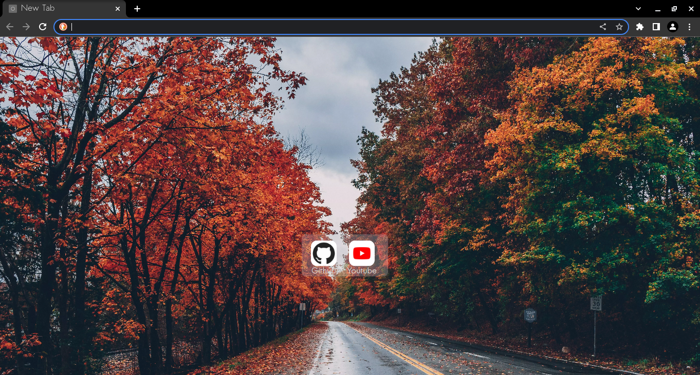

# Open Chrome Wallpaper

> A Chrome extension for setting wallpapers in new tabs

## Installation
follow this step-by-step [guide](./docs/installation.md) to how to use the extension in your browser

## How to customize
- [change wallpaper](./docs/change_wallpaper.md)
- [change shortcuts](./docs/change_shortcuts.md)
