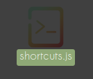

# How to add your own shortcuts

Note: All contents(images & shortcuts) are stored locally. As extensions can't have access to your local files. You have to do the work manually

## Step 1 - Open the `shortcuts.js`
It is located in `config/shortcuts.js`
 

## Step 2 - Add a new line for your shortcut
Lets say we want to add a shortcut for twitter
 
 **name** -> Is the name will be displayed for that shortcut
 **link** -> Is where you'll be redirected for when you click the shortcut

#### Important
1. Except the last line, in the end of each string you must place a comma(,)
2. All links must start with http or https

# And its done!
 
