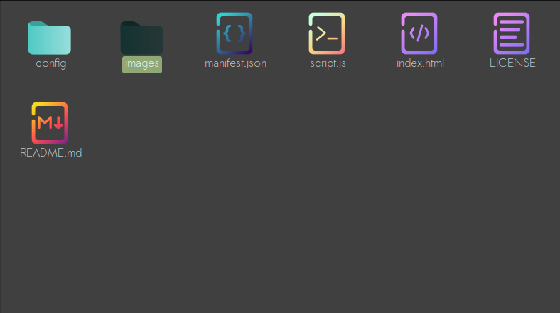
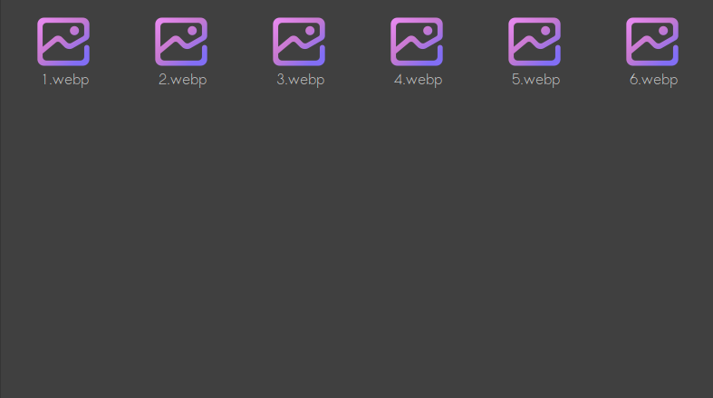
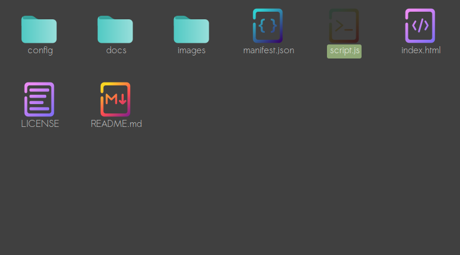
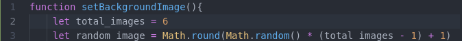

# How to add your own images to background

Note: All contents(images & shortcuts) are stored locally. As extensions can't have access to your local folders. You have to do the work manually

## Step 1 - Open the images folder
 

## Step 2 - Place your images
Your images must be sorted numerically and in the webp format. As shows the image below
 
(you can use this [online tool](https://convertio.co/webp-converter/) to convert images)

## Step 3 - Change the total_images value
Open the file ``script.js``
 

In the second line change the value of ``total_images`` for the amount of images you have in the images folder
 

If you have 6 images, **total_images** = 6
 if you have 3 images, **total_images** = 3
 if you have 1 image, **total_images** = 1
 and so on

# And it is done!
