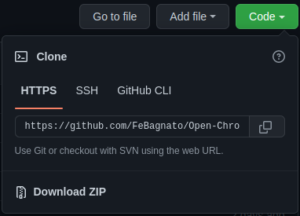
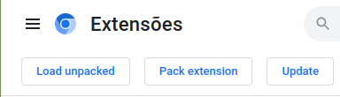

# Installation

### Step 1
Download the extension 

 (if you download the zip file, dont forget to unzip)

### Step 2
Open the Chrome extension page and turn on the "Developer Mode"

### Step 3
Click "Load unpacked" and select the extension folder you downloaded

## And it is done!
